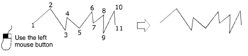

# Manual stitches

|              | Use Traditional Digitizing > Manual to digitize individual ‘manual’ stitches.    |
| -------------------------------------------- | -------------------------------------------------------------------------------- |
|  | Use Traditional Digitizing > Triple Manual to digitize triple ‘manual’ stitches. |

Digitize individual stitches with the Manual method. You can enter single manual stitches, or enter three stitch layers at a time with the Triple Manual tool. Manual stitches digitized together form a single embroidery object. The only properties of [manual objects](../../glossary/glossary) are general and [connector](../../glossary/glossary) properties. They are not well suited to [scaling](../../glossary/glossary#scaling) and transforming actions. Use them sparingly, for example to add a few stitches to a finished design.

## Related topics

- [Digitizing manual stitches](../../Modifying/functions/Digitizing_manual_stitches)
- [Digitize boring holes](../../Applied/mixed/Digitize_boring_holes)
