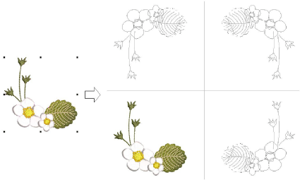

# Mirror selections horizontally & vertically

|    | Use Mirror Merge > Mirror Copy Horizontal to duplicate and mirror objects or designs in the horizontal plane.                  |
| ---------------------------------------------- | ------------------------------------------------------------------------------------------------------------------------------ |
|    | Use Mirror Merge > Mirror Copy Vertical to duplicate and mirror objects or designs in the vertical plane.                      |
|  | Use Mirror Merge > Mirror Copy Horizontal & Vertical to duplicate and mirror objects or designs simultaneously in both planes. |

Use the Mirror Merge Horizontal and Vertical tools to duplicate and mirror selections simultaneously. Simply select objects and click a tool to duplicate and mirror in any plane. Click to mark the reflection point and press Enter to confirm.

## Related video

<iframe src="https://www.youtube.com/embed/bnus8J1z4Ec" frameborder="0" 
		 allow="accelerometer; autoplay; encrypted-media; gyroscope; picture-in-picture" 
		 allowfullscreen="" style="width: 560px; height: 315px;">

</iframe>

## Related topics

- [Mirror selections horizontally & vertically](../../Modifying/productivity/Mirror_selections_horizontally_vertically)
