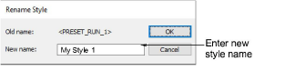
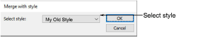

# Modify styles

The Rename Style dialog lets you rename a style without affecting its settings.

## Merge with style

Use Merge With Style to merge settings from one [style](../../glossary/glossary) to another. When you merge, the settings from the second style overwrite the first.

## Related topics

- [Modify styles](../../Digitizing/properties/Modify_styles)
