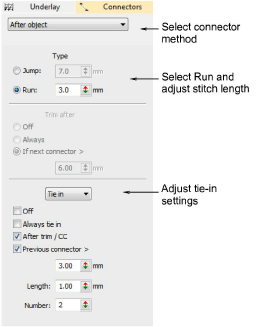

# Object properties > Connectors

In EmbroideryStudio, every object is comprised of a set of object properties. The Object Properties docker lets you view and edit these. The Connectors tab lets you specify the type of connector to use, and set the tie-in, tie-off and trim values you require.

## Related video

<iframe src="https://www.youtube.com/embed/ufk5VIGuABA" frameborder="0" 
		 allow="accelerometer; autoplay; encrypted-media; gyroscope; picture-in-picture" 
		 allowfullscreen="" style="width: 560px; height: 315px;">

&#160;

</iframe>

## Related topics

- [Use jumps as connectors](../../Quality/connectors/Use_jumps_as_connectors)
- [Use runs as connectors](../../Quality/connectors/Use_runs_as_connectors)
- [Automatic tie-in settings](../../Quality/connectors/Automatic_tie-in_settings)
- [Automatic tie-off settings](../../Quality/connectors/Automatic_tie-off_settings)
- [Automatic trim settings](../../Quality/connectors/Automatic_trim_settings)
