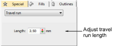

# Object properties > Travel runs

In EmbroideryStudio, every object is comprised of a set of object properties. The Object Properties docker lets you view and edit these. The Special > Travel Run tab lets you change the stitch length of travel runs to vary the stitch count, and to ensure the travel run stitches do not protrude from under the cover stitching.

## Related topics

- [Adjusting travel run stitch length](../../Quality/connectors/Adjusting_travel_run_stitch_length)
