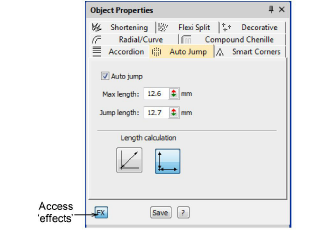
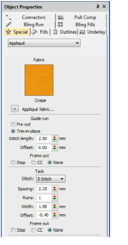
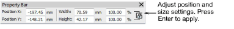

# Object properties docker

|  | Use Docker > Object Properties to preset properties or adjust properties of selected objects. |
| ---------------------------------------------------- | --------------------------------------------------------------------------------------------- |

The most important dialog in EmbroideryStudio is the Object Properties docker. This is a ‘modeless’ dialog, meaning that it stays in the design window as long as you need it. Use it together with the Property Bar to adjust properties of selected objects as you work. Click the FX button to access a separate set of more specialized object property settings such as Accordion Spacing, Stitch Shortening, Smart Corners, etc.

Whenever you change current property settings, these automatically apply to any new objects you create. If you know which settings you require before digitizing, you can preset them.

## Object Properties > Special

The Object Properties > Special tab contains a grab-bag of properties for object types not available on any other tab. These include Appliqué, Bitmap, Complex Fill, Connectors, Complex Turning, Input C, Photo Flash, Travel Run, and Vector.

## Property bar

Adjust general properties – width, height, position – by means of the Property Bar. Press Enter to apply. Press Esc to discard changes.

## Related topics

- [Toolbars & dockers](../../Basics/basics/Toolbars_dockers)
- [Access object properties](../../Basics/basics/Access_object_properties)
- [Work with dockers](../../Basics/basics/Work_with_dockers)
- [Change current settings](../../Digitizing/properties/Change_current_settings)
- [Change object properties](../../Digitizing/properties/Change_object_properties)
- [Copy properties](../../Digitizing/properties/Copy_properties)
- [Scaling objects](../../Modifying/transform/Scaling_objects)
