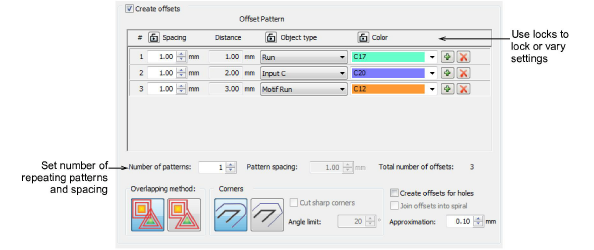

# Outlines & offsets

|  | Use Toolbox > Outlines & Offsets to create outlines and offsets of any type for any filled embroidery or closed vector object. |
| -------------------------------------------------- | ------------------------------------------------------------------------------------------------------------------------------ |

Use the Outlines & Offsets tool to add outline stitching to selected objects or entire designs with a complete range of outline styles. Any closed shape can be used, including [vector objects](../../glossary/glossary), runs, or any filled shapes.

## Related video

<iframe src="https://www.youtube.com/embed/tFPqBZ9O9V0" frameborder="0" 
		 allow="accelerometer; autoplay; encrypted-media; gyroscope; picture-in-picture" 
		 allowfullscreen="" style="width: 560px; height: 315px;">

&#160;

</iframe>

## Related video

<iframe src="https://www.youtube.com/embed/Nzh2A7dIxaI" frameborder="0" 
		 allow="accelerometer; autoplay; encrypted-media; gyroscope; picture-in-picture" 
		 allowfullscreen="" style="width: 560px; height: 315px;">

&#160;

</iframe>

## Related topics

- [Create outlines & offsets](../../Modifying/productivity/Create_outlines_offsets)
- [Create negative offsets](../../Modifying/productivity/Create_negative_offsets)
