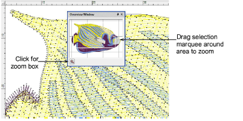

# Overview window

|  | Use Docker > Overview Window to toggle Overview window display on/off. Use it to view a thumbnail of the design. |
| ------------------------------------------------ | ---------------------------------------------------------------------------------------------------------------- |

Use the Overview Window to view a thumbnail of the design. Use it to pan and zoom the design when working at high zoom factors. Set view settings independently to the design window.

Tip: Use Auto Scroll to scroll the design automatically while you are digitizing. This can be more convenient than using panning or the scroll bars.

## Related topics

- [Work with the Overview Window](../../Basics/view/Work_with_the_Overview_Window)
