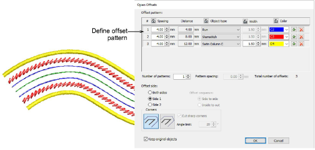

# Parallel offsets

|  | Use Toolbox > Open Offsets to create precise offsets for any open embroidery or vector object. |
| -------------------------------------------------- | ---------------------------------------------------------------------------------------------- |

The Open Offsets tool allows you to generate parallel offsets from any open shape. Offset lines are calculated at a specified distance for a specified number, one side or other side, or both sides.

## Related video

<iframe src="https://www.youtube.com/embed/j7hc48DltSs" frameborder="0" 
		 allow="accelerometer; autoplay; encrypted-media; gyroscope; picture-in-picture" 
		 allowfullscreen="" style="width: 560px; height: 315px;">

&#160;

</iframe>

## Related topics

- [Create offsets with open objects](../../Modifying/productivity/Create_offsets_with_open_objects)
