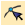
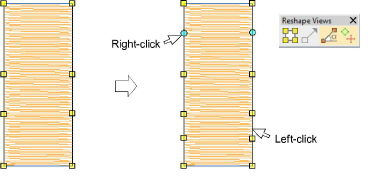
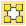
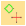
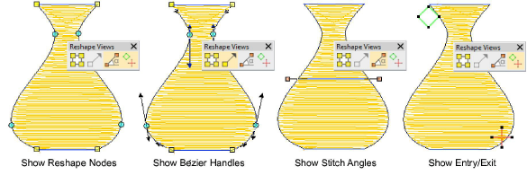

# Reshape tools

|  | Use Reshape > Reshape Object to reshape selected objects, edit stitch angles, and adjust entry/exit points. |
| ---------------------------------------------- | ----------------------------------------------------------------------------------------------------------- |

The Reshape Object tool is an important tool in EmbroideryStudio. Use it to add or delete reshape nodes on the object outline. For some objects, you can also change corner reshape nodes to curves. You can click and drag reshape nodes to reshape object outlines or use [Bézier](../../glossary/glossary) control handles to change outline shapes. EmbroideryStudio also lets you select a range of reshape nodes in open and closed objects, making reshaping operations quick and simple.

## Reshape views

|  | Use Reshape Views > Show Reshape Nodes to toggle on/off reshape nodes for selected objects.                                                      |
| ---------------------------------------------------- | ------------------------------------------------------------------------------------------------------------------------------------------------ |
|            | Use Reshape Views > Show Bézier Handles to toggle on/off Bézier handles for selected objects.                                                    |
|  | Use Reshape Views > Show Stitch Angles to toggle on/off stitch angles for selected objects.                                                      |
|        | Use Reshape Views > Show Entry/Exit to toggle on/off entry/exit points for selected objects – respectively, green diamond and red cross markers. |

EmbroideryStudio offers a number of techniques for reshaping [embroidery objects](../../glossary/glossary), all with the one tool. Sometimes you may need to cut, split or break up complex or compound objects in order to fine-tune them. Various tools are available for this purpose. As well as reshaping object outlines, you can add and adjust [stitch angles](../../glossary/glossary), a property unique to embroidery objects. You can also change the [entry ](../../glossary/glossary)and [exit](../../glossary/glossary) points of individual objects which is important if you are digitizing manually or resequencing embroidery objects.

## Related video

<iframe src="https://www.youtube.com/embed/j5-IPsbaQjg" frameborder="0" 
		 allow="accelerometer; autoplay; encrypted-media; gyroscope; picture-in-picture" 
		 allowfullscreen="" style="width: 560px; height: 315px;">

&#160;

</iframe>

## Related topics

- [View control points](../../Modifying/reshape/View_control_points)
- [Reshaping embroidery objects](../../Modifying/reshape/Reshaping_embroidery_objects)
- [Reshaping stars & rings](../../Modifying/reshape/Reshaping_stars_rings)
- [Adjusting individual letters](../../Lettering/lettering_edit/Adjusting_individual_letters)
- [Reshape baselines interactively](../../Lettering/lettering_edit/Reshape_baselines_interactively)
- [Add stitch angles in Reshape mode](../../Quality/quality/Add_stitch_angles_in_Reshape_mode)
- [Reshape motif runs](../../Decorative/motifs/Reshape_motif_runs)
