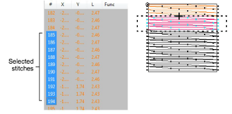

# Select & deselect stitches

|  | Use Stitch > Stitch Edit to select individual stitches for editing. |
| ---------------------------------------- | ------------------------------------------------------------------- |

The Stitch Edit tool lets you select single stitches, several stitches, or a range of stitches by selecting their needle points, or dragging a [selection marquee](../../glossary/glossary) around them. You can select all stitches in a design, cancel all selections, or remove individual stitches from a selected group. Selected stitches are highlighted in a different color. You can also select individual stitches in your design using the Stitch List.

## Related topics

- [Select stitches by needle point](../../Modifying/functions/Select_stitches_by_needle_point)
- [Select stitches while traveling](../../Modifying/functions/Select_stitches_while_traveling)
- [Insert stitches](../../Modifying/functions/Insert_stitches)
- [Edit stitches](../../Modifying/functions/Edit_stitches)
- [Recognize object outlines](../../Modifying/functions/Recognize_object_outlines)
