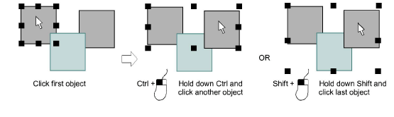

# Select object

|      | Use Select > Select Object to select individual objects as well as groups or ranges of objects. |
| ------------------------------------------------ | ----------------------------------------------------------------------------------------------- |
|  | Use Select > Freehand Select to select object at current by drawing a freehand line.            |
|    | Click Select > Polygon Select to select objects with a selection marquee.                       |
|  | Click Select > Polyline Select to draw a line through the object to select.                     |

EmbroideryStudio provides various ways to select [embroidery objects](../../glossary/glossary#embroidery-objects). It supports point & click, [selection marquee](../../glossary/glossary#selection-marquee) and multiple object selection.

- The simplest way to select an object is to point and click with the Select Object tool activated. [Selection handles](../../glossary/glossary) appear around selected objects.

- Alternatively, use the Freehand Select tool to draw a freeline around the object/s you want to select. Press Enter to close.
- Alternatively, use the Polygon Select tool to mark reference points around the object/s you want to select. Press Enter to close.
- Or use Polyline Select to mark two or more reference points to create a line touching all objects you want to select.

## Related topics

- [Selecting objects](../../Basics/basics/Selecting_objects)
