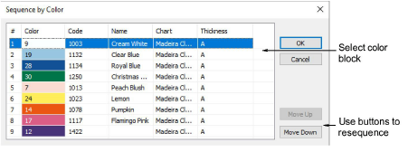

# Sequence by color block

|  | Use Sequence > Sequence by Color to resequence all blocks of like color. |
| ------------------------------------------------------------ | ------------------------------------------------------------------------ |

The Sequence by Color feature lets you resequence all design objects by color. This technique resequences all color blocks of the same color.

## Related topics

- [Sequence by color](../../Modifying/combine/Sequence_by_color)
