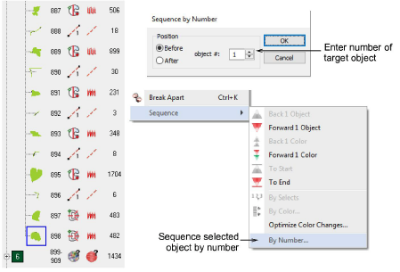

# Sequence by number

|  | Use Docker > Color-Object List to resequence objects. |
| ------------------------------------------------------------ | ----------------------------------------------------- |

You can resequence objects numerically in the Color-Object List. Use it to move an object to a position between consecutive members of a color block. This technique is used primarily with designs containing many objects where precise object sequencing is important.

## Related topics

- [Sequence by number](../../Modifying/combine/Sequence_by_number)
