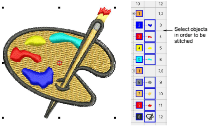

# Sequence by selection order

|  | Use Sequence > Sequence by Selects to resequence objects in the order selected. |
| ---------------------------------------------------------------- | ------------------------------------------------------------------------------- |

You can resequence objects by selecting them in the required stitching order.

## Related topics

- [Sequence by selection order](../../Modifying/combine/Sequence_by_selection_order)
