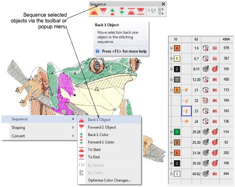

# Sequence selected objects

|              | Use Sequence > Back 1 Object to move a selection back one object in the stitching sequence.       |
| ------------------------------------------------------ | ------------------------------------------------------------------------------------------------- |
|          | Use Sequence > Forward 1 Object to move a selection forward one object in the stitching sequence. |
|                | Use Sequence > Back 1 Color to move a selection back one color in the stitching sequence.         |
|          | Use Sequence > Forward 1 Color to move a selection forward one color in the stitching sequence.   |
|              | Use Sequence > Move to Start to move a selection to start of stitching sequence.                  |
|                  | Use Sequence > Move to End to move a selection to end of stitching sequence.                      |
|  | Use Sequence > Sequence by Selects to resequence objects in the order selected.                   |
|      | Use Sequence > Sequence by Color to resequence all blocks of like color.                          |

The Sequence toolbar provides a convenient means for sequencing selected objects. Use it in conjunction with the Color-Object List. Alternatively, use the popup menu Sequence option to resequence objects ‘on-the-fly’. The same options can be accessed from the Color-Object List popup menu.

## Related topics

- [Sequence selected objects](../../Modifying/combine/Sequence_selected_objects)
