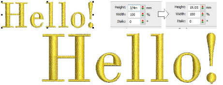

# Set measurement units

|  | Use View > Measurement Units to change measurement units within software without changing system settings. |
| ---------------------------------------------- | ---------------------------------------------------------------------------------------------------------- |

The first time you run EmbroideryStudio, the measurement system will default to whatever the operating system is using. You can use different measurement units within EmbroideryStudio without having to exit and change system settings. This is useful, for example, if you receive orders from places that use a different measurement system. The most common scenario is where a US customer orders lettering in inches – say ¾" – and the digitizing is to be done in metric. The digitizer can then easily enter ‘3/4"’ without having to first do any mathematical conversion to mm.

## Related topics

- [Set measurement units](../../Basics/basics/Set_measurement_units)
