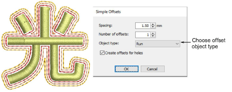

# Simple offsets

|  | Use Toolbox > Simple Offsets to create simple outlines for any filled embroidery or closed vector object. |
| ---------------------------------------------- | --------------------------------------------------------------------------------------------------------- |

When available, the Simple Offsets feature allows you to quickly create outline stitching around selected objects or entire designs with a variety of outline styles.

## Related video

<iframe src="https://www.youtube.com/embed/tFPqBZ9O9V0" frameborder="0" 
		 allow="accelerometer; autoplay; encrypted-media; gyroscope; picture-in-picture" 
		 allowfullscreen="" style="width: 560px; height: 315px;">

</iframe>

## Related video

<iframe src="https://www.youtube.com/embed/WDr7mekerI0" frameborder="0" 
		 allow="accelerometer; autoplay; encrypted-media; gyroscope; picture-in-picture" 
		 allowfullscreen="" style="width: 560px; height: 315px;">

</iframe>

## Related topics

- [Simple offsets](../../Modifying/productivity/Simple_offsets)
