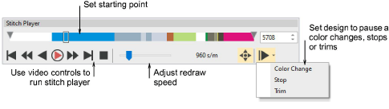

# Simulate design stitchouts

|  | Use View > Stitch Player to simulate embroidery design stitchout on screen. |
| -------------------------------------------- | --------------------------------------------------------------------------- |

Stitch Player is an important tool in EmbroideryStudio. It lets you simulate the actual embroidery design stitchout on screen. Because Stitch Player emulates the movements of the embroidery machine, you are able to make decisions about how to optimize your design in order to lessen the load on the machine. This is important if you intend to make multiple stitchouts.

## Related video

<iframe src="https://www.youtube.com/embed/GsTXzaTgCfg" frameborder="0" 
		 allow="accelerometer; autoplay; encrypted-media; gyroscope; picture-in-picture" 
		 allowfullscreen="" style="width: 560px; height: 315px;">

&#160;

</iframe>

## Related topics

- [Simulate design stitchouts](../../Basics/view/Simulate_design_stitchouts)
- [Travel through designs](../../Basics/view/Travel_through_designs)
