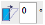
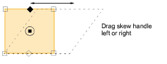

# Skew objects

|  | Use Transform > Skew to skew selected objects by an exact amount (in degrees). |
| ---------------------------- | ------------------------------------------------------------------------------ |

You can skew objects directly on screen or by setting an exact skew angle.

## Related topics

- [Skewing objects](../../Modifying/transform/Skewing_objects)
