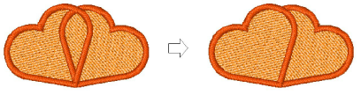

# Split objects

|  | Use Stitch > Split Object to split object in two at current needle position. Use with Travel by Stitch functions. |
| ------------------------------------------ | ----------------------------------------------------------------------------------------------------------------- |

Use the Split Object command to split most embroidery objects. Run objects may also be split but [Complex Fill](../../glossary/glossary) and Complex Turning objects may not.

## Related topics

- [Splitting objects](../../Modifying/functions/Splitting_objects)
