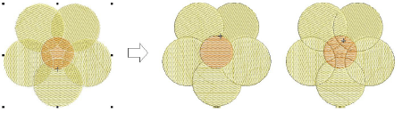

# Split vector & embroidery objects

|  | Use Shaping > Overlap to adjust the overlaps of objects resulting from Flatten or Divide shaping operations.                        |
| ---------------------------------- | ----------------------------------------------------------------------------------------------------------------------------------- |
|  | Use Shaping > Flatten to trim all overlaps while retaining the original objects.                                                    |
|    | Use Shaping > Divide to split selected objects into separate adjoining objects wherever they intersect with other selected objects. |

Split selected objects using the Flatten or Divide tools. These tools preserve the outlines of the original shapes. The Overlap setting allows you to add overlaps to objects resulting from Flatten or Divide shaping operations.

## Related topics

- [Split vector & embroidery objects](../../Modifying/reshape/Split_vector_embroidery_objects)
