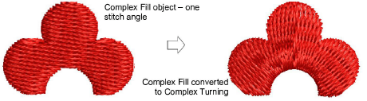

# Stitch angle tools

|              | Use Stitch Angle Tools > Stitch Angles to add stitch angles to selected objects.                                 |
| -------------------------------------------------------- | ---------------------------------------------------------------------------------------------------------------- |
|  | Use Stitch Angle Tools > Remove Stitch Angles to remove stitch angles from closed objects with turning stitches. |

Add [stitch angles](../../glossary/glossary) to most [embroidery objects](../../glossary/glossary#embroidery-objects) interactively using the Stitch Angles tool. Create embroidery objects by adding stitch angles directly to [vector objects](../../glossary/glossary).

## Related topics

- [Add angles in stitch angles mode](../../Quality/quality/Add_angles_in_stitch_angles_mode)
