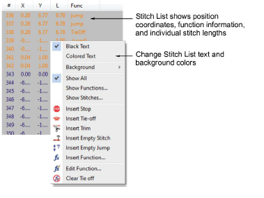

# Stitch list

|  | Use Docker > Stitch List to toggle Stitch List display on and off. Use it to select individual stitches. |
| ---------------------------------------- | -------------------------------------------------------------------------------------------------------- |

You can view and select individual stitches in your design by means of the Stitch List. The Stitch List dialog lets you locate and select stitches for editing.

The Move Stitch dialog lets you edit the coordinates, and therefore position, of individual stitches.

The Show Stitches dialog lets you apply a filter to the Stitch List so that only stitches of a certain length appear in the list.

The Show Functions dialog lets you apply a filter to the Stitch List so that only stitches associated with specific functions appear in the list.

## Related topics

- [Select stitches with the Stitch List](../../Modifying/functions/Select_stitches_with_the_Stitch_List)
- [Filter stitches by stitch length](../../Modifying/functions/Filter_stitches_by_stitch_length)
- [Edit stitches](../../Modifying/functions/Edit_stitches)
- [Editing machine functions](../../Modifying/functions/Editing_machine_functions)
- [Filtering stitches & functions](../../Modifying/functions/Filtering_stitches_functions)
- [Filter stitches by function](../../Modifying/functions/Filter_stitches_by_function)
