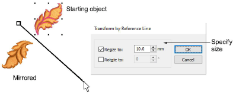

# Transform by reference line

|            | Use Transform > Transform by Reference Line Freely to rotate selected objects with the aid of reference points alone.                             |
| ------------------------------------------------------------------------------------------ | ------------------------------------------------------------------------------------------------------------------------------------------------- |
|  | Use Transform > Transform by Reference Line Numerically to transform selected objects using a combination of reference points and numeric values. |
|                              | Use Transform > Mirror by Reference Line to mirror objects around a defined axis using a reference line.                                          |

The Transform tool provides another method for transforming selected objects using a combination of reference points and numeric values. This provides a very accurate technique for rotating selected objects.

You can scale objects to the same size as a reference object. Resize the height or width separately or both. Use Mirror by Reference Line to mirror objects around a reference line.

## Related topics

- [Rotate objects by reference line](../../Modifying/transform/Rotate_objects_by_reference_line)
- [Rotate objects by reference line and angle](../../Modifying/transform/Rotate_objects_by_reference_line_and_angle)
- [Scale objects by reference line](../../Modifying/transform/Scale_objects_by_reference_line)
- [Mirror objects around an axis](../../Modifying/transform/Mirror_objects_around_an_axis)
