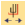
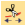
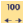
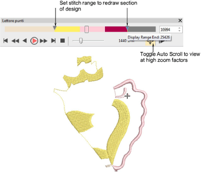

# Travel tools

|          | Left/right-click Travel > Start/End Design to travel to start or end of the design.                     |
| -------------------------------------------------------- | ------------------------------------------------------------------------------------------------------- |
|          | Left/right-click Travel > Travel by Object to travel to previous or next object.                        |
|        | Left/right-click Travel > Travel by Segment to travel to previous or next segment.                      |
|            | Left/right-click Travel > Travel by Color to travel to previous or next color change.                   |
|      | Left/right-click Travel > Travel by Function to travel to previous or next machine function.            |
|              | Left/right-click Travel > Travel by Trim to travel to previous or next trim function.                   |
|  | Left/right-click Travel > Travel 1000 Stitches to travel backwards or forwards 1000 stitches at a time. |
|    | Left/right-click Travel > Travel 100 Stitches to travel backwards or forwards 100 stitches at a time.   |
|      | Left/right-click Travel > Travel 10 Stitches to travel backwards or forwards 10 stitches at a time.     |
|            | Left/right-click Travel > Travel 1 Stitch to travel backwards or forwards 1 stitch at a time.           |

It is useful to be able to view the stitching sequence color-by-color, object-by-object, or even stitch-by-stitch. The Travel toolbar provides all tools required to do so. Travel forwards or backwards with any button by right or left mouse-clicks. Traveling can be initiated from any stitch in the design. The current needle position is marked by a white cross or ‘needle position marker’. The current stitch number is displayed in the Status Bar.

Tip: While traveling through a design or editing stitches, click the Select Current icon or press Shift+0 to select the object associated with the current cursor position.

## Related topics

- [Travel through designs](../../Basics/view/Travel_through_designs)
- [Simulate design stitchouts](../../Basics/view/Simulate_design_stitchouts)
- [Select objects while traveling](../../Basics/view/Select_objects_while_traveling)
