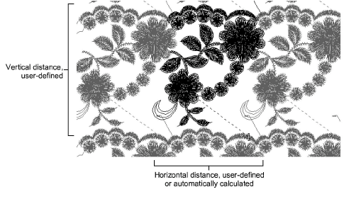
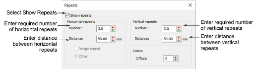

# View design repeats

|  | Use View > Show Repeats to toggle design repeats display. Right-click for settings. |
| ------------------------------------------ | ----------------------------------------------------------------------------------- |

Many customers make traditional garments such as sarees which employ continuous and sometimes overlapping designs. It is important to be able to see these designs together with their repeats. The Show Repeats function displays repeating designs, including sequins, in both TrueView and stitch view. You can view a design, even while digitizing, with any number of repeats. The number can be a whole number or fractional.

It is important that the artwork you use is properly sized and in the correct horizontal position. Always check the position of your artwork before starting to digitize.

## Related topics

- [Viewing design repeats](../../Basics/view/Viewing_design_repeats)
- [Visualizing vector graphics](../../Automatic/vectors/Visualizing_vector_graphics)
