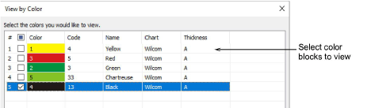

# View designs by color

The View by Color function lets you view [embroidery objects](../../glossary/glossary#embroidery-objects) by color. This is particularly useful when you are reseqencing objects by color. [See also Select by color.](Select_by_color)

## Related topics

- [View selected color blocks](../../Basics/view/View_selected_color_blocks)
