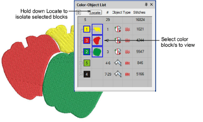

# View designs with the Color-Object List

|  | Use Docker > Color-Object List to toggle the Color-Object List display on and off. Use to view and sequence design objects. |
| -------------------------------------------------- | --------------------------------------------------------------------------------------------------------------------------- |

The Color-Object List provides a sequential list of [embroidery objects](../../glossary/glossary) as digitized, grouped by [color block](../../glossary/glossary). It offers an easy way to selectively view color blocks and objects.

## Related video

<iframe src="https://www.youtube.com/embed/lM820ENY6PI" frameborder="0" 
		 allow="accelerometer; autoplay; encrypted-media; gyroscope; picture-in-picture" 
		 allowfullscreen="" style="width: 560px; height: 315px;">

&#160;

</iframe>

## Related topics

- [Work with dockers](../../Basics/basics/Work_with_dockers)
- [Viewing color blocks](....\Basics\view\Viewing_color_blocks)
- [Sequence with the Color-Object List](../../Modifying/combine/Sequence_with_the_Color-Object_List)
- [Sequence by number](../../Modifying/combine/Sequence_by_number)
- [Select objects with Color-Object List](../../Basics/basics/Select_objects_with_Color-Object_List)
- [Branch objects with the Color-Object List](../../Quality/connectors/Branch_objects_with_the_Color-Object_List)
- [Group & ungroup objects](../../Modifying/combine/Group_ungroup_objects)
