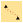
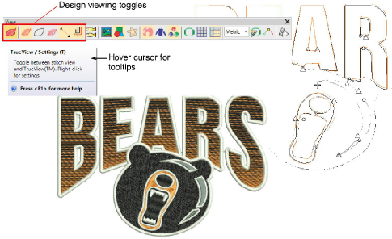

# View embroidery components

|                  | Use View > TrueView™ to toggle between stitch view and TrueView™.                              |
| ---------------------------------------------------- | ------------------------------------------------------------------------------------------------ |
|          | Use View > Show Stitches to toggle embroidery stitching display.                                 |
|          | Use View > Show Outlines to toggle object outlines.                                              |
|  | Use View > Show Needle Points to toggle needle points to select stitches for editing.            |
|      | Use View > Show Connectors to toggle connecting stitches to help position entry and exit points. |
|        | Use View > Show Functions to toggle display of machine functions such as trims and tie-offs.     |

When you open an embroidery design in EmbroideryStudio, toggles on the View toolbar allow you to alternate between ‘artistic’ and ‘technical’ views. Use TrueView for presentation purposes. You can include it on approval sheets, or capture it as a bitmap to send via email or publish to a website.

::: tip
Depending on the design background, change display colors for selected objects, unsewn stitches, etc.
:::

## Related topics

- [View embroidery components](../../Basics/view/View_embroidery_components)
- [Visualizing sequin designs](../../Applied/sequin_basics/Visualizing_sequin_designs)
- [Select stitches by needle point](../../Modifying/functions/Select_stitches_by_needle_point)
- [Design viewing options](../../Setup/settings/Design_viewing_options)
