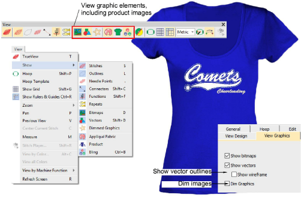

# View graphical components

|  | Use View > Show Bitmaps to show and hide bitmap images. Right-click to set image display options.   |
| ------------------------------------------ | --------------------------------------------------------------------------------------------------- |
|  | Use View > Show Vectors to show and hide vector graphics. Right-click to set image display options. |
|    | Use View > Dim Artwork to dim graphic backdrops to show stitches more clearly for digitizing.       |

Apart from embroidery, [EMB](../../glossary/glossary) designs may include other components such as bitmap images, [vector graphics](../../glossary/glossary), appliqué fabrics, product backdrops, and rhinestones or ‘bling’. These can also be turned on or off as desired. The Options > View Graphics dialog lets you set options for viewing artwork. You can dim bitmaps as well as show/hide vector drawings.

## Related topics

- [View graphical components](../../Basics/view/View_graphical_components)
- [Image viewing options](../../Setup/settings/Image_viewing_options)
- [Insert bitmap images](../../Automatic/bitmaps/Insert_bitmap_images)
- [Insert vector graphics](../../Automatic/vectors/Insert_vector_graphics)
- [Import vector graphics](../../Automatic/vectors/Import_vector_graphics)
- [Visualizing vector graphics](../../Automatic/vectors/Visualizing_vector_graphics)
