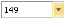
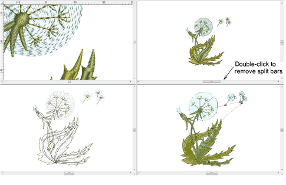
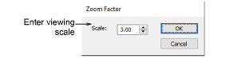

# Zoom & pan designs

|                      | Click Zoom > Zoom to invoke zoom mode – zoom in or out via left and right mouse clicks.       |
| ------------------------------------------------ | --------------------------------------------------------------------------------------------- |
|                | Click Zoom > Zoom 1:1 to display a design at actual size.                                     |
|            | Click Zoom > Zoom to Fit to display the whole design in the design window.                    |
|  | Click Zoom > Zoom to Selected to magnify selected object.                                     |
|          | Select Zoom > Zoom Factor from the dropdown list to display the design at a particular scale. |

Zoom tools allow you to magnify your view of the design by zooming in on individual stitches or details. The easiest way to zoom is via the mouse wheel. This defaults to 1.25 increments. The zoom factor can be adjusted in the Options > Scroll tab. Zoom tools are also available from the View menu and Zoom toolbar. Experiment with the available options.

The Zoom Factor dialog lets you adjust the view magnification by entering a scale as a percentage of actual size.

## Related topics

- [Zoom & pan designs](../../Basics/view/Zoom_pan_designs)
- [Scroll options](../../Setup/settings/Scroll_options)
- [Printing design reports](../../Production/reports/Printing_design_reports)
