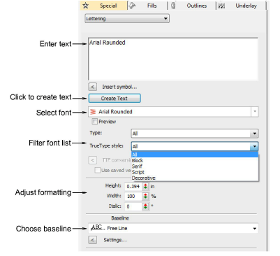
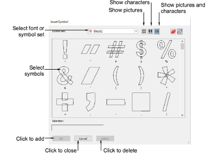

# Add embroidery lettering

|  | Use Toolbox > Lettering to create embroidery lettering directly on-screen. Right-click to access settings. |
| -------------------------------------- | ---------------------------------------------------------------------------------------------------------- |

You can add lettering to a design by typing it directly on screen or entering it via the Object Properties docker. The Object Properties > Special > Lettering tab lets you select embroidery fonts, and specify letter formatting and stitching values. Add letters or special characters. Edit and resize lettering objects. Change letter width, angle, and position, and choose baselines.

## Insert symbols

The Insert Symbol dialog lets you add/delete special characters and symbols in your lettering objects. The same dialog box is used to select motifs for use in your design.

## Related video

<iframe src="https://www.youtube.com/embed/ntNNpkf1LfM" frameborder="0" 
		 allow="accelerometer; autoplay; encrypted-media; gyroscope; picture-in-picture" 
		 allowfullscreen="" style="width: 560px; height: 315px;">

&#160;

</iframe>

## Related topics

- [Creating lettering with object properties](..\..\Lettering\lettering create\Creating_lettering_with_object_properties)
- [Adjusting lettering properties](../../Lettering/lettering_create/Adjusting_lettering_properties)
- [Inserting symbols](..\..\Lettering\lettering advanced\Inserting_symbols)
- [Advanced Embroidery Lettering](../../Lettering/lettering_advanced/Advanced_Embroidery_Lettering)
- [Creating lettering with object properties](..\..\Lettering\lettering create\Creating_lettering_with_object_properties)
- [Custom Lettering](../../Lettering/lettering_custom/Custom_Lettering)
- [Editing Embroidery Lettering](../../Lettering/lettering_edit/Editing_Embroidery_Lettering)
- [Selecting embroidery fonts](..\..\Lettering\lettering create\Selecting_embroidery_fonts)
- [Formatting lettering](..\..\Lettering\lettering create\Formatting_lettering)
