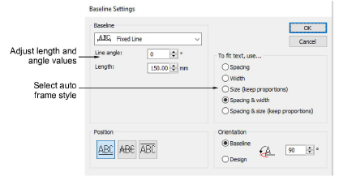

# Baseline settings

You can customize letter, word and line spacing using the Baseline Settings dialog, as well as specify values for each baseline and letter orientation.

## Related video

<iframe src="https://www.youtube.com/embed/4lh45WNRWl4" frameborder="0" 
		 allow="accelerometer; autoplay; encrypted-media; gyroscope; picture-in-picture" 
		 allowfullscreen="" style="width: 560px; height: 315px;">

</iframe>

## Related video

<iframe src="https://www.youtube.com/embed/0zS9rbcvm-E" frameborder="0" 
		 allow="accelerometer; autoplay; encrypted-media; gyroscope; picture-in-picture" 
		 allowfullscreen="" style="width: 560px; height: 315px;">

</iframe>

## Related video

<iframe src="https://www.youtube.com/embed/v5kEYq8tRGs" frameborder="0" 
		 allow="accelerometer; autoplay; encrypted-media; gyroscope; picture-in-picture" 
		 allowfullscreen="" style="width: 560px; height: 315px;">

</iframe>

## Related video

<iframe src="https://www.youtube.com/embed/iWgfb6oa5Wg" frameborder="0" 
		 allow="accelerometer; autoplay; encrypted-media; gyroscope; picture-in-picture" 
		 allowfullscreen="" style="width: 560px; height: 315px;">

</iframe>

## Related topics

- [Adjusting fixed-width baseline settings](..\..\Lettering\lettering edit\Adjusting_fixed-width_baseline_settings)
- [Adjusting curved baseline settings](..\..\Lettering\lettering edit\Adjusting_curved_baseline_settings)
- [Changing letter orientation](..\..\Lettering\lettering edit\Changing_letter_orientation)
