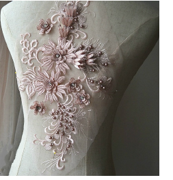

# Beading

Bead embroidery is a type of applied decoration where beads, like sequins, are stitched rather than glued to fabric, suede, or leather. Unlike woven, knitted, and crocheted beading, embroidered beading does not form part of the fabric structure. Traditionally, it has been used on garments and decorative textiles. Accessories such as handbags or belt buckles may also be embellished with bead embroidery. As may household items such as pillowcases or cushions.

## Related video

<iframe src="https://www.youtube.com/embed/jjXFmGF6HEE" title="YouTube video player" 
		 frameborder="0" allow="accelerometer; autoplay; clipboard-write; encrypted-media; gyroscope; picture-in-picture" 
		 allowfullscreen="" style="width: 560px; height: 315px;">

&#160;

</iframe>

## Related topics

- [Set up bead palette](Set_up_bead_palette)
- [Digitize bead runs](Digitize_bead_runs)
- [Edit bead runs](Edit_bead_runs)
- [Digitize manual bead drops](Digitize_manual_bead_drops)
- [Encode bead drops on output](Encode_bead_drops_on_output)
