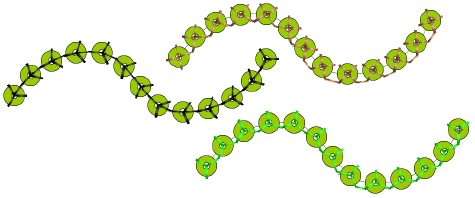

# Change sequins & fixing stitches

|  | Use Sequin > Sequin Palette to select from a user-defined palette of sequin shapes for the current design. |
| ---------------------------------------------- | ---------------------------------------------------------------------------------------------------------- |

You can select sequins before or after digitizing. Similarly, you can preset fixing stitches or change them at any stage.

Note: Sequin Run stitch has potential as a decorative stitch in its own right. For this purpose you can select None in the Sequin Palette. This option is best used with the Sequin Drop Direction set to Any.

## Related topics

- [Sequin fixings](../../Applied/sequin_basics/Sequin_fixings)
- [Setting up sequin palettes](../../Applied/sequin_basics/Setting_up_sequin_palettes)
- [Digitizing sequin runs](../../Applied/sequin_basics/Digitizing_sequin_runs)
