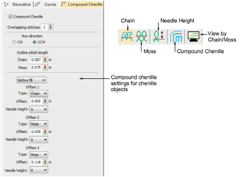

# Chenille

|                        | Use Chenille > Chain to create flat stitches traditionally used as a border or outline for moss stitches. Right-click to adjust settings.                                             |
| ---------------------------------------------------- | ------------------------------------------------------------------------------------------------------------------------------------------------------------------------------------- |
|                          | Use Chenille > Moss to create a looped pile look. Right-click to adjust settings.                                                                                                     |
|          | Use Chenille > Needle Height to control height of loop formed when sewing moss stitch as well as width of chain stitch.                                                               |
|  | Use Chenille > Compound Chenille to automatically digitize chenille shapes with offset borders. Right-click to adjust automatic offset borders.                                       |
|    | Use Chenille > View by Chain/Moss to view chenille objects in special mode to allow easy identification of chain and Moss elements – lockstitch in green, chain in blue, moss in red. |

In EmbroideryStudio, you use a single design workspace for both chenille and lockstitch embroidery. In addition, with the Chenille add-on activated, there is a dedicated Chenille template, a Chenille toolbar with chenille-specific stitch types and machine functions, dedicated chenille fonts, and a dedicated tab on the Object Properties docker.

Tip: For further information about the Chenille tools, refer to the Chenille Supplement supplied with the Chenille Option. This is available via the Help menu.

## Related video

<iframe width="560" height="315" src="https://www.youtube.com/embed/VoPmf_xPMPo" title="YouTube video player" frameborder="0" allow="accelerometer; autoplay; clipboard-write; encrypted-media; gyroscope; picture-in-picture" allowfullscreen></iframe>

## Related topics

- [Chenille stitch types](Chenille_stitch_types)
- [Compound chenille](Compound_chenille)
- [Chenille needle height](Chenille_needle_height)
- [Chenille stitch patterns](Chenille_stitch_patterns)
