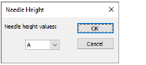

# Chenille needle height

|  | Use Chenille > Needle Height to control height of loop formed when sewing moss stitch as well as width of chain stitch. |
| ------------------------------------------------------ | ----------------------------------------------------------------------------------------------------------------------- |

The needle height controls the height of the loop formed by the chenille machine when it is sewing a moss stitch, and the width of the chain stitch. You can insert Needle Height functions and select the positions during digitizing. The Melco tape file format has specific codes assigned to each needle height position.

## Related topics

- [Controlling needle heights](../../Chenille/chenille_digitizing/Controlling_needle_heights)
