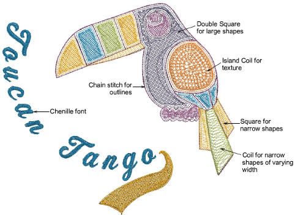

# Chenille stitch patterns

|              | Use Outline Stitch Types > Square to create open borders or columns of even width for an open ‘toothed’ effect. Right-click for settings.                                                                  |
| -------------------------------------------- | ---------------------------------------------------------------------------------------------------------------------------------------------------------------------------------------------------------- |
|    | Use Fill Stitch Types > Square to create open straight parallel fills. Right-click for settings.                                                                                                           |
|  | Use Fill Stitch Types > Double Square to create grid fills. Apply closed shapes. Right-click for settings.                                                                                                 |
|                  | Use Outline Stitch Types > Coil to create borders or columns of even width for an open ‘coil’ effect. Right-click to adjust settings.                                                                      |
|        | Use Fill Stitch Types > Coil to stitch narrow shapes or columns where each stitch traverses the column width. Right-click to adjust settings.                                                              |
|      | Use Fill Stitch Types > Island Coil to fill large Complex Fill objects with concentric rows of coil stitching, simulating the circular motion of hand-chenille embroidery. Right-click to adjust settings. |

EmbroideryStudio also provides a number of fill stitch types associated with chenille work – Square, Double Square, Coil, and Island Coil. The stitch type you use depends on the input tool used as well as the object shape, size and the effect you want to achieve. These stitch types can be used both with chenille and lockstitch style embroidery.

## Related topics

- [Chenille patterns](../../Decorative/specialty/Chenille_patterns)
- [Chenille fill patterns](../../Chenille/chenille_basics/Chenille_fill_patterns)
- [Chenille fill pattern usage](../../Chenille/chenille_digitizing/Chenille_fill_pattern_usage)
