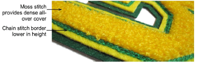

# Chenille stitch types

|  | Use Chenille > Chain to create flat stitches traditionally used as a border or outline for moss stitches. Right-click to adjust settings. |
| ---------------------------------------- | ----------------------------------------------------------------------------------------------------------------------------------------- |
|    | Use Chenille > Moss to create a looped pile look. Right-click to adjust settings.                                                         |

Digitizing chenille objects involves the same techniques as regular lockstitch embroidery with the addition of chenille stitch types, Moss and Chain. For chenille work, you mainly use Complex Fill in combination with Compound Chenille to digitize objects – even narrow ones – with built-in chain or moss borders.

## Related topics

- [Chenille stitch types](../../Chenille/chenille_basics/Chenille_stitch_types)
- [Create compound chenille objects](../../Chenille/chenille_digitizing/Create_compound_chenille_objects)
