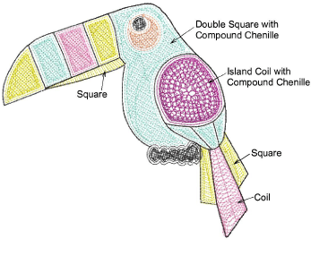

# Compound chenille

|  | Use Chenille > Compound Chenille to automatically digitize chenille shapes with offset borders. Right-click to adjust automatic offset borders. |
| -------------------------------------------------------------- | ----------------------------------------------------------------------------------------------------------------------------------------------- |

Digitizing chenille objects involves the same techniques as regular lockstitch embroidery with the addition of chenille stitch types, Moss and Chain. For chenille work, you mainly use Complex Fill in combination with Compound Chenille to digitize objects – even narrow ones – with built-in chain or moss borders.

Compound Chenille is usually used digitized with Moss stitching as the fill type. Chenille objects generally include a Chain border to contain the fill and provide edge definition. Single offset run-arounds before and after are usually sufficient.

## Related video

<iframe width="560" height="315" src="https://www.youtube.com/embed/VoPmf_xPMPo" title="YouTube video player" frameborder="0" allow="accelerometer; autoplay; clipboard-write; encrypted-media; gyroscope; picture-in-picture" allowfullscreen></iframe>

## Related topics

- [Creating compound chenille](../../Chenille/chenille_digitizing/Creating_compound_chenille)
- [Compound chenille settings](../../Chenille/chenille_digitizing/Compound_chenille_settings)
