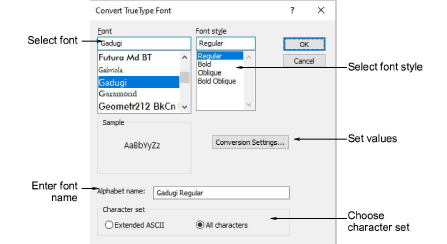
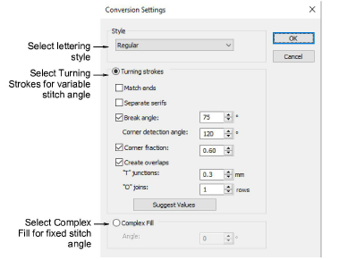

# Convert TrueType font

The Convert TrueType Font dialog lets you convert any TrueType font installed on your system to an embroidery font.

## Conversion settings

The Conversion Settings dialog is used to convert any TrueType font installed on your system to an embroidery font. You can do this ‘on the fly’ or convert entire fonts for later use.

## Related video

<iframe src="https://www.youtube.com/embed/69NbBKbWFQ8" frameborder="0" 
		 allow="accelerometer; autoplay; encrypted-media; gyroscope; picture-in-picture" 
		 allowfullscreen="" style="width: 560px; height: 315px;">

</iframe>

## Related topics

- [Converting letters on-the-fly](..\..\Lettering\lettering custom\Converting_letters_on-the-fly)
- [Converting TrueType fonts](..\..\Lettering\lettering custom\Converting_TrueType_fonts)
- [Converting TrueType fonts to embroidery](../../Lettering/lettering_custom/Converting_TrueType_fonts_to_embroidery)
- [Converting & editing TrueType fonts](../../Management/custom_fonts/Converting_editing_TrueType_fonts)
