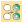
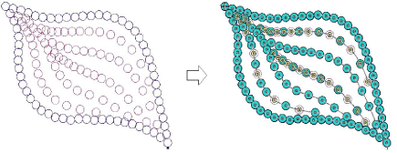

# Convert sequin artwork

|  | Use Sequin > Vectors to Sequins to create a sequin run from a set of sequin vector objects selected by intersecting line. |
| ---------------------------------------------------- | ------------------------------------------------------------------------------------------------------------------------- |

Frequently, artwork for sequin designs is independently created by a specialist designer and supplied to the embroidery digitizer as a vector file. The Vectors to Sequins tool is available for just this purpose. A sequin run is automatically created from a set of vector objects representing sequins. Fixing stitches are generated automatically according to current settings. If you are digitizing twin-sequin runs, EmbroideryStudio will generate sequin drops according to the currently selected sequin run pattern.

## Related topics

- [Convert sequin artwork](../../Applied/sequin_advanced/Convert_sequin_artwork)
- [Apply multi-sequin run patterns](../../Applied/sequin_basics/Apply_multi-sequin_run_patterns)
