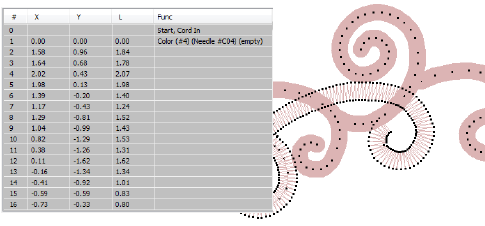

# Cording

|                            | Use Outline Stitch Types > Run to place a row of single run stitches along a digitized line. Right-click for settings. |
| ---------------------------------------------------- | ---------------------------------------------------------------------------------------------------------------------- |
|                    | Use Stitch Effects > Cording to apply or execute cording effect to new or selected objects with run stitching.         |
|  | Click View > Show Needle Points to show or hide the needle points in embroidery stitching.                             |

To create a cording design in EmbroideryStudio, simply digitize a run with Cording turned on. Any suitable input method can be used together with Run stitch. Some machines have a specific cording function which is output when saving to machine file – e.g. Barudan FDR-3 file format or Schiffli machines that support cording. For machines that don’t have an explicit cording function, the software outputs a Stop code.

## Related video

<iframe src="https://www.youtube.com/embed/ln4-d1xSchs" frameborder="0" 
		 allow="accelerometer; autoplay; clipboard-write; encrypted-media; gyroscope; picture-in-picture" 
		 allowfullscreen="" style="width: 560px; height: 315px;">

</iframe>

## Related topics

- [Cording](../../Applied/mixed/Cording)
