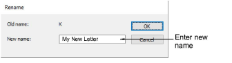

# Create alphabets

The Create Alphabet dialog lets you name a new embroidery font and set the default spacing and join type for adjacent letters.

When you create a new letter, the Create Letter dialog lets you choose a font for it, give it a name, specify its height, and indicate whether or not to keep any machine functions.

The Manage Alphabet dialog lets you modify a custom font to change its name, the default spacing between letters or the default join type.

The Rename Alphabet dialog lets you rename custom fonts.

The Rename Letter dialog lets you rename custom letters.

## Related video

<iframe src="https://www.youtube.com/embed/rv34v_FqWdE" frameborder="0" 
		 allow="accelerometer; autoplay; encrypted-media; gyroscope; picture-in-picture" 
		 allowfullscreen="" style="width: 560px; height: 315px;">

&#160;

</iframe>

## Related video

<iframe src="https://www.youtube.com/embed/qYpFyHIXaB8" frameborder="0" 
		 allow="accelerometer; autoplay; encrypted-media; gyroscope; picture-in-picture" 
		 allowfullscreen="" style="width: 560px; height: 315px;">

&#160;

</iframe>

## Related topics

- [Create custom letters](../../Lettering/lettering_custom/Create_custom_letters)
- [Save custom letters](../../Lettering/lettering_custom/Save_custom_letters)
- [Select custom fonts](../../Lettering/lettering_custom/Select_custom_fonts)
- [Converting & editing TrueType fonts](../../Management/custom_fonts/Converting_editing_TrueType_fonts)
- [Manage fonts](../../Lettering/lettering_custom/Manage_fonts)
