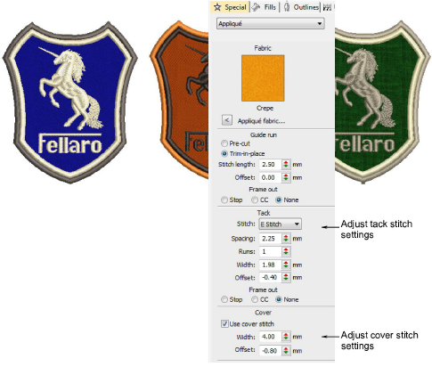
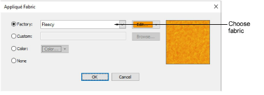

# Create appliqué embroidery

|                          | Use Appliqué > Appliqué to digitize partial cover appliqué objects.                                                                                                                    |
| ------------------------------------------------------------ | -------------------------------------------------------------------------------------------------------------------------------------------------------------------------------------- |
|  | Use Appliqué > Appliqué without Holes to digitize single-boundary appliqué objects with up to four layers of stitching – guide runs, cutting lines, tack stitches, and cover stitches. |
|            | Use Appliqué > Partial Appliqué to create partial cover stitching for overlapping appliqué objects.                                                                                    |
|            | Use Appliqué > Combine Appliqué Components to break apart multiple appliqué objects into component objects and combine and resequence them for efficient stitchout.                    |

Automatically create all the stitching you need for [appliqué](../../glossary/glossary) using the Appliqué tool. When you digitize an object with Appliqué, the [guide run](../../glossary/glossary), tacking and cover stitches are automatically generated using the current Appliqué settings. The Object Properties > Special > Appliqué tab lets you produce the stitching you require for appliqué objects.

EmbroideryStudio lets you select a fabric swatch for appliqué objects. The swatch becomes a property of the object. Choose from amongst the included ‘factory’ swatches or choose a scanned sample of the fabric you want to use.

## Related video

<iframe src="https://www.youtube.com/embed/JR48hKBfNyY" frameborder="0" 
		 allow="accelerometer; autoplay; encrypted-media; gyroscope; picture-in-picture" 
		 allowfullscreen="" style="width: 560px; height: 315px;">
</iframe>

## Related topics

- [Creating appliqué embroidery](../../Applied/applique/Creating_appliqué_embroidery)
- [Digitize appliqué objects](../../Applied/applique/Digitize_appliqué_objects)
- [Convert embroidery objects to appliqué](../../Applied/applique/Convert_embroidery_objects_to_appliqué)
- [Add fabric swatches to appliqué](../../Applied/applique/Add_fabric_swatches_to_appliqué)
- [Adjusting appliqué settings](../../Applied/applique/Adjusting_appliqué_settings)
- [Combining appliqué](../../Applied/applique/Combining_appliqué)
- [Outputting appliqué](../../Applied/applique/Outputting_appliqué)
