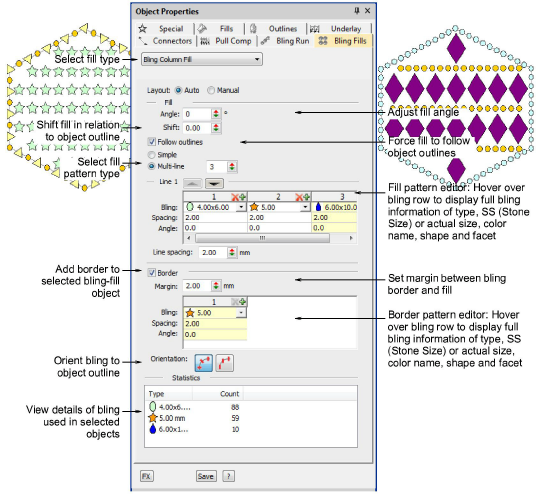

# Create bling fills

|  | Use Bling > Bling Fill to digitize complex shapes (with or without holes) filled with bling. |
| -------------------------------------- | -------------------------------------------------------------------------------------------- |

The Bling Fill feature provides a means of filling complex shapes with bling arranged in columns. Bling fill types include Column Fill (straight grid, angled grid) and Contour Fill. The fill can include a border, with or without a margin inset from the object outline. The object border can be made from different or same rhinestones and is a property of the bling-fill object.

## Related topics

- [Bling production processes](../../Applied/bling/Bling_production_processes)
- [Create bling fills](../../Applied/bling/Create_bling_fills)
- [Add bling borders](../../Applied/bling/Add_bling_borders)
