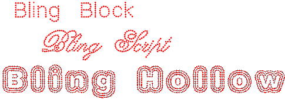

# Create bling lettering

|  | Use Bling > Bling Lettering to create bling lettering onscreen using native bling fonts, embroidery fonts, or TrueType fonts. Right-click for settings. |
| ------------------------------------------------ | ------------------------------------------------------------------------------------------------------------------------------------------------------- |

Use the dedicated Bling Lettering tool to create lettering in the same way as embroidery lettering. Use the same properties as embroidery lettering. Depending on the font, you also have access to Bling Run or Bling Fill properties. Alternatively, various techniques exist to create bling text without lettering properties.

## Related topics

- [Bling production processes](../../Applied/bling/Bling_production_processes)
- [Creating bling lettering](../../Applied/bling/Creating_bling_lettering)
