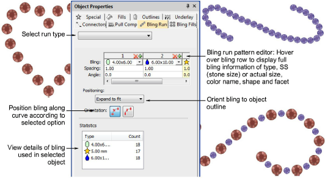

# Create bling runs

|  | Use Bling > Bling Run Auto to create a string of rhinestones along a digitized line according to current settings. |
| -------------------------------------------- | ------------------------------------------------------------------------------------------------------------------ |

Use the Bling Run Auto method to create a string of rhinestones along a digitized line. There are two available types – Simple Run (same size stones) and Pattern Run (different sizes following a regular pattern). The system automatically generates drops according to current settings.

## Related topics

- [Bling production processes](../../Applied/bling/Bling_production_processes)
- [Digitize bling runs](../../Applied/bling/Digitize_bling_runs)
