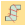

# Create lettering in CorelDRAW Graphics

|  | Use Mode > Tag Fill as Turning Satin to tag narrow shapes for conversion to turning stitching. |
| -------------------------------------------------------------- | ---------------------------------------------------------------------------------------------- |

Some EmbroideryStudio product levels include CorelDRAW® Graphics Suite as standard. This allows you to add and format TrueType lettering in CorelDRAW Graphics. This can then be converted to either embroidery lettering or embroidery objects.

## Related video

<iframe src="https://www.youtube.com/embed/5Sqab5N2y8o" frameborder="0" 
		 allow="accelerometer; autoplay; clipboard-write; encrypted-media; gyroscope; picture-in-picture" 
		 allowfullscreen="" style="width: 560px; height: 315px;">

&#160;

</iframe>

## Related topics

- [Creating lettering with CorelDRAW Graphics](../../Lettering/lettering_create/Creating_lettering_with_CorelDRAW_Graphics)
- [Convert objects with CorelDRAW Graphics](../../Automatic/automatic/Convert_objects_with_CorelDRAW_Graphics)
